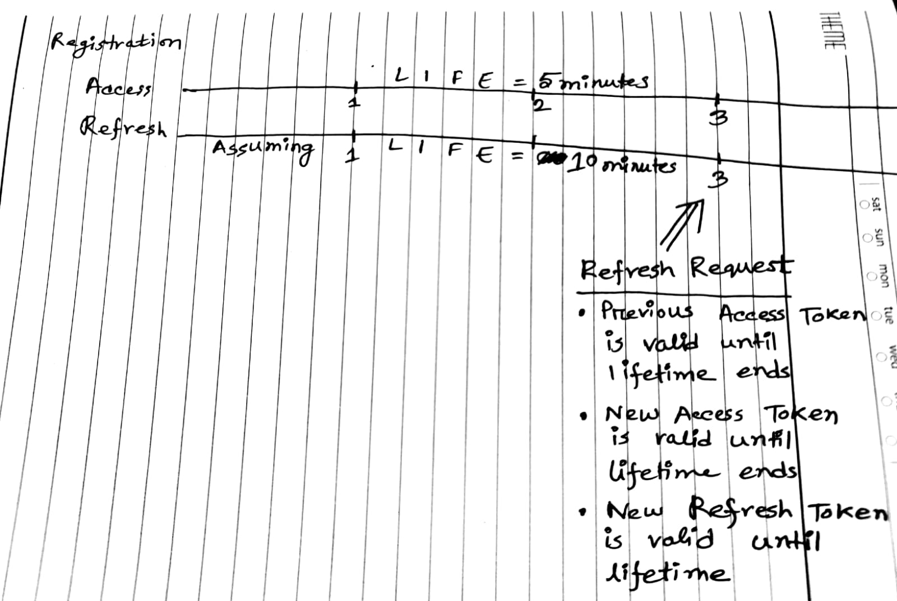
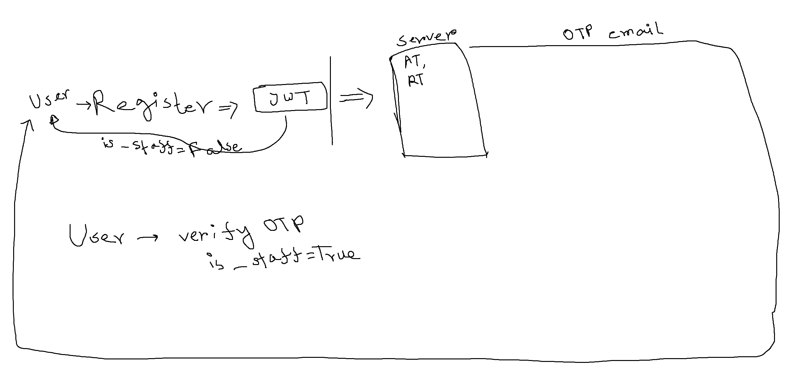

# JWT_Auth_Implementation

working on implementation of JWT with email OTP
- Implementation is complete 
- Sliding token concept is not covered
- will update and rearrange documentation shortly

## Workflow

- User registers, gets an active account with ACCESS_TOKEN and REFRESH_TOKEN
- User also receives a mail with an OTP
- User goes to otp verification endpoint and verifies otp
- User gets better access
- User perform operations with protected data
- User ACCESS_TOKEN expires
- User gets new ACCESS_TOKEN and new REFRESH_TOKEN, requesting with the current REFRESH_TOKEN to refresh token endpoint
- User's old REFRESH_TOKEN gets blacklisted
- User logs out, current REFRESH_TOKEN gets blacklisted

## API REFERENCE

|ACTIONS|HTTP METHODS|ENDPOINTS|
|-----------------|---|--------------|
|LOGIN WITH AN ACCOUNT|POST|/api/login/|
|VERIFY ACCOUNT WITH OTP| POST |/api/verify/|
|REFRESH TOKEN|POST|/api/refresh/|
|LOGOUT OF AN ACCOUNT|GET|/api/logout/|
|REGISTER FOR AN ACCOUNT|POST|/api/register/|
|EXPERIMENT WITH AN ENDPOINT|POST|/api/experiment/|

## Repository Structure

```
├─ images
│  └─ note1.png
├─ jwt_with_email_otp
│  ├─ asgi.py
│  ├─ settings.py
│  ├─ urls.py
│  ├─ wsgi.py
│  └─ __init__.py
├─ LICENSE
├─ manage.py
├─ README.md
├─ requirement.txt
└─ users
   ├─ admin.py
   ├─ api
   │  ├─ serializers.py
   │  ├─ urls.py
   │  └─ views.py
   ├─ apps.py
   ├─ emails.py
   ├─ models.py
   ├─ tests.py
   ├─ views.py
   └─ __init__.py

```
## Notes that I took during implementation

#### Rotate Refresh Token : False, Blacklist Token : False
- __RefreshView__ Endpoint sends back __ACCESS_TOKEN__ only
- Same __Refresh Token__ can be used to generate multiple __access__ tokens
- Lifespan = Refresh Token Lifetime

#### Rotate Refresh Token : True, Blacklist Token : False

- __RefreshView__ Endpoint sends back both __ACCESS_TOKEN__ and __REFRESH_TOKEN__
- Same __Refresh Token__ can be used to generate multiple __access__ tokens and __refresh__ tokens
- Lifespan = Refresh Token Lifetime
- New __Refresh Tokens__ have new extended lifetime

#### Rotate Refresh Token : True, Blacklist Token : True

- __RefreshView__ Endpoint sends back both __ACCESS_TOKEN__ and __REFRESH_TOKEN__
- Same __Refresh Token__ cannot be used anymore
- New __Refresh Tokens__ can be used to generate multiple __access__ tokens and __refresh__ tokens
#### Side Note


